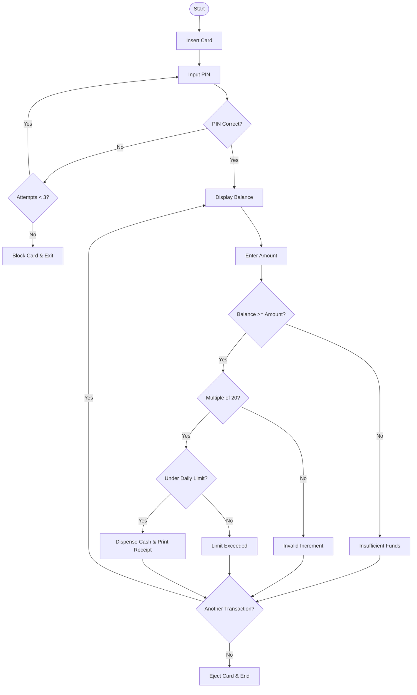
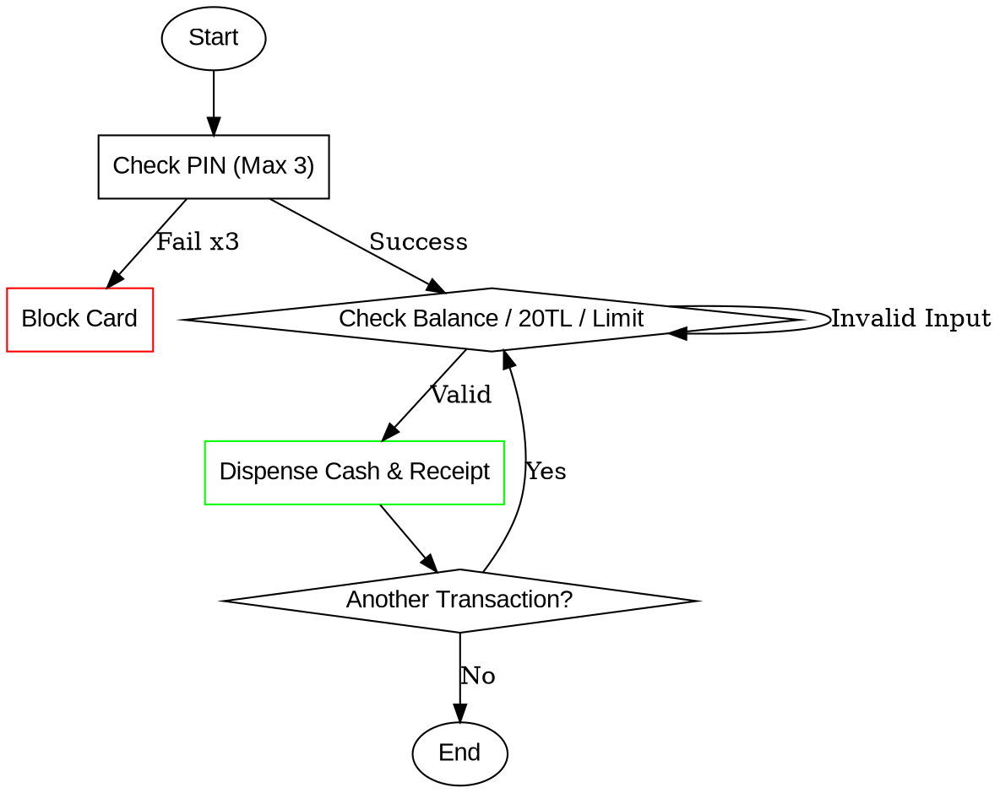
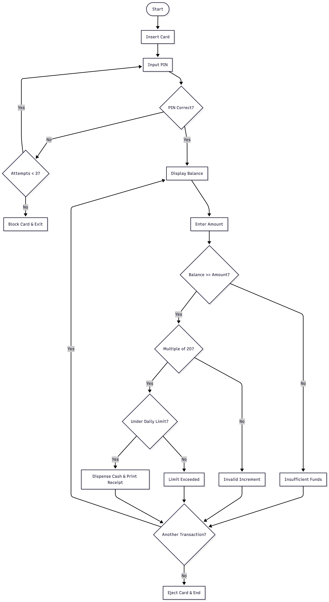
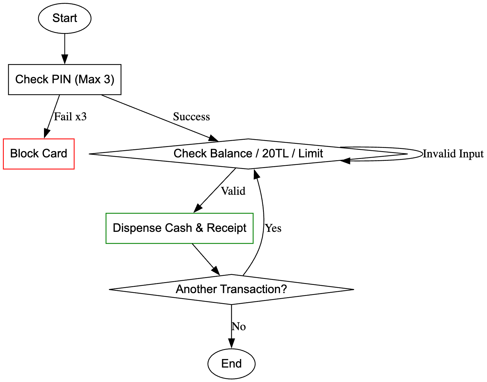

# Task 1: ATM Cash Withdrawal System

## Overview

This task models an **ATM Cash Withdrawal System** that handles card-based authentication with PIN verification (max 3 attempts), balance display, and cash withdrawal with multiple validation checks. The system supports repeated transactions within a single session.

---

## Files

| File | Description |
|------|-------------|
| `pseudocode.md` | Full pseudocode for ATM process with PIN verification and withdrawal validation |
| `flowchart.mmd` | Mermaid flowchart diagram |
| `flowchart.dot` | Graphviz DOT flowchart diagram |
| `llm_conversation.md` | Link to the LLM conversation used to generate this task |
| `task1-mermaid.png` | Rendered Mermaid flowchart image |
| `task1-graphviz.png` | Rendered Graphviz flowchart image |

---

## System Flow

The system follows a **linear process with validation loops**:

### 1. Card Insertion & PIN Verification
- User inserts card
- PIN input with a maximum of **3 attempts**
- If all 3 attempts fail → card is blocked and system exits

### 2. Transaction Loop
- Display current account balance
- User enters withdrawal amount
- Amount passes through **3 sequential validation checks**
- On success: dispense cash, print receipt, update balance
- User chooses to perform another transaction or exit

### 3. Session End
- Card is ejected
- System returns to idle

---

## Validation Checks

| # | Check | Error Message |
|---|-------|---------------|
| 1 | Sufficient balance? | "Error: Insufficient Balance" |
| 2 | Multiple of 20 TL? | "Error: Amount must be a multiple of 20TL" |
| 3 | Within daily limit? | "Error: Daily limit exceeded" |

---

## Pseudocode

```
START ATM_PROCESS
    WHILE Card_Inserted IS TRUE:
        SET pin_attempts = 0
        SET authenticated = FALSE
        
        // PIN Verification Loop (Max 3 attempts)
        WHILE pin_attempts < 3 AND authenticated IS FALSE:
            INPUT user_pin
            IF user_pin IS CORRECT:
                SET authenticated = TRUE
            ELSE:
                INCREMENT pin_attempts
                PRINT "Incorrect PIN"
        
        IF authenticated IS FALSE:
            PRINT "Card Blocked"
            EXIT SYSTEM
        
        // Transaction Loop
        DO:
            DISPLAY account_balance
            INPUT withdrawal_amount
            
            IF withdrawal_amount > account_balance:
                PRINT "Error: Insufficient Balance"
            ELSE IF withdrawal_amount % 20 != 0:
                PRINT "Error: Amount must be a multiple of 20TL"
            ELSE IF withdrawal_amount > daily_limit:
                PRINT "Error: Daily limit exceeded"
            ELSE:
                DISPENSE cash
                PRINT receipt
                UPDATE account_balance
            
            INPUT "Would you like another transaction?" (choice)
        WHILE choice IS "YES"
        
        EJECT_CARD
    END WHILE
END ATM_PROCESS
```

---

## Flowchart (Mermaid)



---

## Flowchart (Graphviz DOT)



---

## Flowchart Images

### Mermaid Flowchart


### Graphviz Flowchart


---

## Key Features

| Feature | Description |
|---------|-------------|
| PIN Security | Maximum 3 attempts before card is blocked |
| Balance Check | Prevents overdraft withdrawals |
| 20 TL Increment | ATM only dispenses multiples of 20 TL |
| Daily Limit | Enforces daily withdrawal cap |
| Multi-Transaction | Supports multiple withdrawals in one session |
| Receipt Printing | Automatic receipt after successful withdrawal |

---

## LLM Conversation

[View the LLM conversation on Gemini](https://gemini.google.com/share/72624c46b234)
