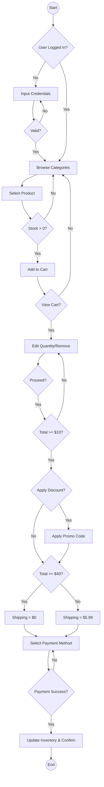
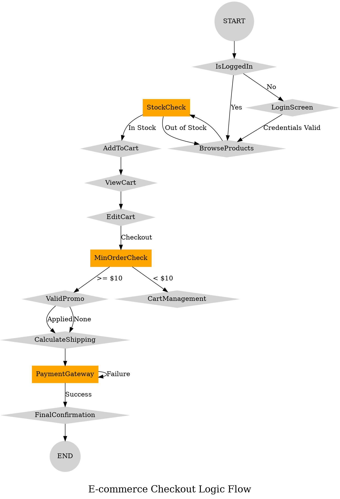

# Task 2: E-Commerce Checkout System

## Overview

This task models an **E-Commerce Checkout System** that covers the complete online shopping flow — from user authentication through product browsing, cart management, checkout calculations, to payment processing and order confirmation.

---

## Files

| File | Description |
|------|-------------|
| `pseudocode.md` | Detailed pseudocode covering all 5 sections of the system |
| `flowchart.mmd` | Mermaid flowchart diagram |
| `flowchart.dot` | Graphviz DOT flowchart diagram |
| `llm_conversation.txt` | Link to the LLM conversation used to generate this task |

---

## System Flow

The system is divided into **5 main sections**:

1. **User Authentication** — Login validation and session management
2. **Product Browsing & Cart Addition** — Category browsing, product display, and stock-checked cart additions
3. **Cart Management** — Quantity editing, item removal, stock validation
4. **Checkout Calculations** — Minimum order check ($10), promo code/discount application, shipping threshold ($40 for free shipping)
5. **Payment & Finalization** — Payment method selection (Credit Card, PayPal, Crypto), gateway authorization, inventory update, and order confirmation

---

## Pseudocode

```
START E_COMMERCE_SYSTEM_PROCESS
    // SECTION 1: USER LOGIN
    START USER_AUTHENTICATION
        IF user_is_logged_in THEN
            PROCEED to PRODUCT_BROWSING
        ELSE
            DISPLAY login_screen
            INPUT credentials
            IF credentials_valid THEN
                SET user_session = ACTIVE
                PROCEED to PRODUCT_BROWSING
            ELSE
                DISPLAY "Invalid Login"
                RESTART USER_AUTHENTICATION
            END
        END
    END

    // SECTION 2: PRODUCT BROWSING & CART ADDITION
    START PRODUCT_BROWSING
        LOOP while browsing_is_active
            DISPLAY category_list
            IF category_selected THEN
                LOOP for each product in category_results
                    DISPLAY product_info
                    IF add_to_cart_clicked THEN
                        IF stock_count > 0 THEN
                            ADD product_id TO cart_array
                        ELSE
                            DISPLAY "Item currently unavailable"
                        END
                    END
                END
            END
            IF view_cart_clicked THEN BREAK LOOP
        END
    END

    // SECTION 3: CART MANAGEMENT
    START CART_MANAGEMENT
        LOOP while user_is_reviewing_cart
            DISPLAY cart_array
            CALCULATE running_subtotal
            IF change_quantity_clicked THEN
                INPUT new_quantity
                IF new_quantity <= available_stock THEN
                    UPDATE cart_item_quantity
                ELSE
                    SET quantity = available_stock
                END
            END
            IF remove_item_clicked THEN DELETE item FROM cart_array
            IF checkout_button_pressed THEN BREAK LOOP
        END
    END

    // SECTION 4: CHECKOUT CALCULATIONS
    START CHECKOUT_CALCULATION
        IF running_subtotal < 10 THEN RETURN to CART_MANAGEMENT
        IF promo_code_applied AND promo_code_is_valid THEN
            SET discount_amount = (running_subtotal * discount_rate)
            SET running_subtotal = (running_subtotal - discount_amount)
        END
        IF running_subtotal >= 40 THEN SET shipping_fee = 0
        ELSE SET shipping_fee = 5.99
        SET final_total = running_subtotal + shipping_fee
    END

    // SECTION 5: PAYMENT & FINALIZATION
    START PAYMENT_PROCESSING
        INPUT payment_selection
        IF payment_gateway_status == "SUCCESS" THEN
            UPDATE inventory_database
            GENERATE order_id
            SEND_EMAIL_RECEIPT
        ELSE
            RETRY PAYMENT_PROCESSING
        END
    END
END
```

---

## Flowchart (Mermaid)



---

## Flowchart (Graphviz DOT)



---

## Control Points

| # | Control Point | Description |
|---|---------------|-------------|
| 1 | Stock Check | Validates product availability before adding to cart |
| 2 | Stock Validation | Re-validates stock when quantity is changed in cart |
| 3 | Minimum Order | Ensures subtotal is at least $10 before checkout |
| 4 | Discount Application | Validates promo code before applying discount |
| 5 | Shipping Threshold | Free shipping if subtotal >= $40, else $5.99 |
| 6 | Payment Authorization | Payment gateway success/failure handling |

---

## LLM Conversation

[View the LLM conversation on Gemini](https://gemini.google.com/share/c82141c79a9c)
