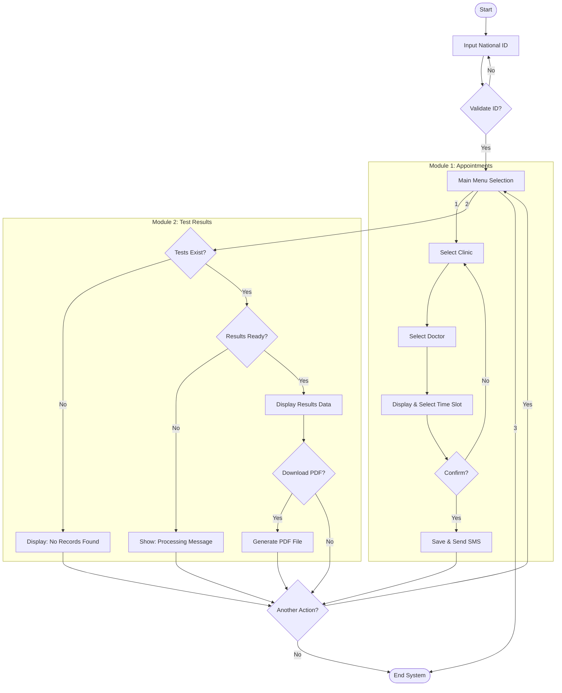
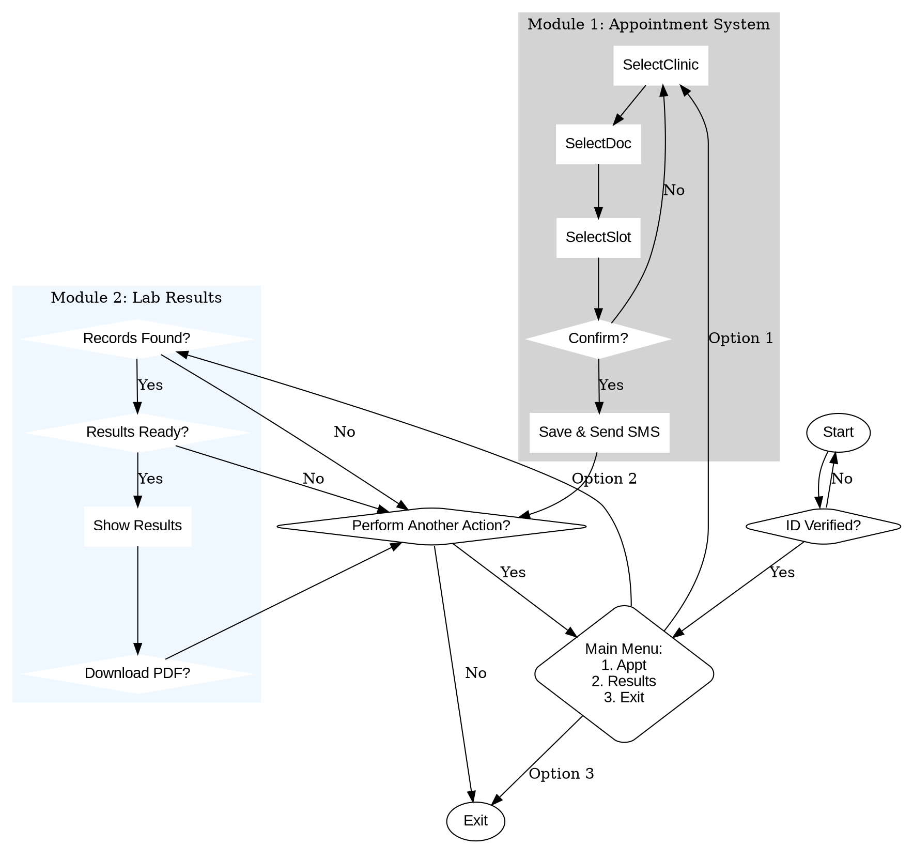

# Task 3: Hospital Appointment & Lab Results System

## Overview

This task models a **Hospital Management System** with two core modules: an **Appointment Booking System** and a **Laboratory Results Viewer**. The system handles patient identity verification, clinic/doctor selection, SMS notifications, and PDF report generation.

---

## Files

| File | Description |
|------|-------------|
| `pseudocode.md` | Full pseudocode with modular functions for appointments and lab results |
| `flowchart.mmd` | Mermaid flowchart diagram with subgraph modules |
| `flowchart.dot` | Graphviz DOT flowchart diagram with clustered modules |
| `llm_conversation.txt` | Link to the LLM conversation used to generate this task |

---

## System Flow

The system consists of a **main controller** and **2 modules**:

### Main Controller
- Patient identity verification via National ID
- Main menu with 3 options: Make Appointment, View Test Results, Exit
- Loop for repeated actions

### Module 1: Appointment System
- Select from available clinics (Cardiology, ENT, Pediatrics, General Surgery)
- Choose a doctor from the selected clinic
- Pick an available time slot
- Confirmation prompt with retry on rejection
- Save appointment and send SMS notification

### Module 2: Laboratory Results
- Check if test records exist for the patient
- Check if results are ready (processed by the lab)
- Display results data
- Optional PDF download/generation

---

## Pseudocode

```
BEGIN Hospital_System
    SET system_active = TRUE
    
    WHILE system_active IS TRUE DO
        INPUT patient_id
        IF validate_identity(patient_id) IS FALSE THEN
            DISPLAY "Error: Identity could not be verified."
            CONTINUE
        ENDIF

        DISPLAY "Main Menu: 1-Make Appointment, 2-View Test Results, 3-Exit"
        INPUT user_action

        SWITCH user_action:
            CASE 1: CALL Module_Make_Appointment(patient_id)
            CASE 2: CALL Module_View_Results(patient_id)
            CASE 3: SET system_active = FALSE
        END SWITCH

        IF system_active IS TRUE THEN
            INPUT repeat_choice
            IF repeat_choice == 'N' THEN SET system_active = FALSE
        ENDIF
    END WHILE
END

FUNCTION Module_Make_Appointment(patient_id)
    WHILE booking_complete IS FALSE DO
        DISPLAY available clinics → INPUT selected_clinic
        DISPLAY doctor list → INPUT selected_doctor
        DISPLAY available slots → INPUT selected_time
        IF confirmation == 'Y' THEN
            save_appointment() → send_sms_notification()
            SET booking_complete = TRUE
        ENDIF
    END WHILE
ENDFUNCTION

FUNCTION Module_View_Results(patient_id)
    IF check_tests_exist() IS FALSE THEN RETURN
    IF check_results_ready() IS TRUE THEN
        DISPLAY results → optional PDF download
    ELSE
        DISPLAY "Results not ready yet."
    ENDIF
ENDFUNCTION
```

---

## Flowchart (Mermaid)



---

## Flowchart (Graphviz DOT)



---

## Key Features

| Feature | Description |
|---------|-------------|
| Identity Verification | National ID validation before any action |
| Modular Design | Separate functions for Appointments and Lab Results |
| SMS Notification | Automatic SMS sent upon appointment confirmation |
| PDF Generation | Optional downloadable PDF for lab results |
| Loop Control | Repeat actions or exit gracefully |

---

## LLM Conversation

[View the LLM conversation on Gemini](https://gemini.google.com/share/12d14904189b)
