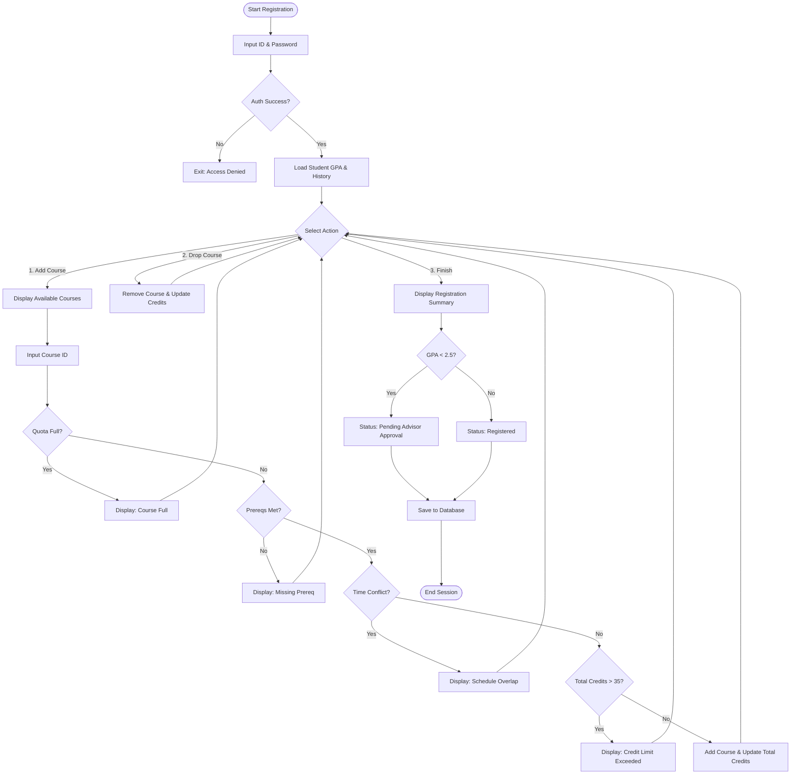
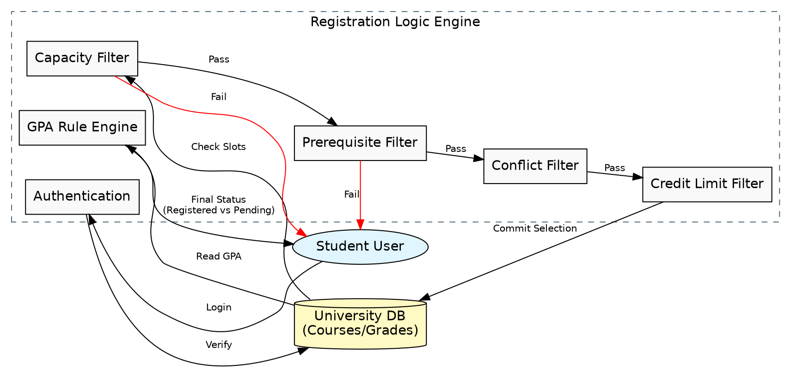

# Task 4: University Course Registration System

## Overview

This task models a **University Course Registration System** that handles student authentication, course enrollment with multi-gate validation, course dropping, and GPA-based advisor approval. The system enforces complex constraints including capacity limits, prerequisite checks, schedule conflict detection, and credit limits.

---

## Files

| File | Description |
|------|-------------|
| `pseudocode.md` | Full pseudocode with nested validation gates and advisor approval logic |
| `flowchart.mmd` | Mermaid flowchart diagram with sequential validation gates |
| `flowchart.dot` | Graphviz DOT diagram with clustered registration logic engine |
| `llm_conversation.txt` | Link to the LLM conversation used to generate this task |

---

## System Flow

The system follows **4 main steps**:

### Step 1: Authentication
- Student inputs ID and password
- System validates credentials against the university database
- Access denied on failure

### Step 2: Data Initialization
- Load student profile (GPA, completed courses)
- Fetch current enrollment and calculate total credits

### Step 3: Main Registration Loop
- **Add Course** — passes through 4 sequential validation gates
- **Drop Course** — removes course and updates credit count
- **Finish** — exits the registration loop

### Step 4: Advisor Approval & Finalization
- Display registration summary
- If GPA < 2.5 → status set to "Pending Advisor Approval"
- If GPA >= 2.5 → status set to "Registered"
- Save to database

---

## Validation Gates

| Gate | Check | Error Message |
|------|-------|---------------|
| Gate 1 | Course capacity full? | "Course is full (Quota reached)" |
| Gate 2 | Prerequisites completed? | "You have not completed [prerequisite]" |
| Gate 3 | Schedule time conflict? | "This course overlaps with your current schedule" |
| Gate 4 | Total credits > 35? | "Adding this would exceed the 35-credit limit" |

---

## Pseudocode

```
BEGIN Registration_System

    // STEP 1: AUTHENTICATION
    INPUT studentID, password
    IF NOT AuthenticateUser(studentID, password) THEN EXIT

    // STEP 2: DATA INITIALIZATION
    studentData = FETCH StudentProfile(studentID)
    currentSchedule = FETCH CurrentEnrollment(studentID)
    totalCredits = SUM(currentSchedule.credits)

    // STEP 3: MAIN REGISTRATION LOOP
    WHILE registrationActive IS TRUE
        INPUT choice (1: Add, 2: Drop, 3: Finish)

        IF choice == 1 THEN
            INPUT selectedCourseID
            // 4 VALIDATION GATES (sequential)
            IF course full → Error
            ELSE IF prereqs not met → Error
            ELSE IF time conflict → Error
            ELSE IF credits > 35 → Error
            ELSE → Add course, update credits

        ELSE IF choice == 2 THEN
            Remove course, update credits

        ELSE IF choice == 3 THEN
            EXIT loop
    END WHILE

    // STEP 4: ADVISOR APPROVAL
    IF studentData.GPA < 2.5 THEN
        status = "PENDING_ADVISOR_APPROVAL"
    ELSE
        status = "REGISTERED"
    END IF

    SAVE_TO_DATABASE(studentID, currentSchedule, status)
END
```

---

## Flowchart (Mermaid)



---

## Flowchart (Graphviz DOT)



---

## Key Features

| Feature | Description |
|---------|-------------|
| Multi-Gate Validation | 4 sequential checks before course enrollment is allowed |
| Credit Limit | Maximum 35 credits per registration |
| GPA-Based Approval | Students with GPA < 2.5 require advisor approval |
| Add/Drop Support | Full support for adding and dropping courses |
| Database Persistence | Final schedule saved with registration status |

---

## LLM Conversation

[View the LLM conversation on Gemini](https://gemini.google.com/share/87184209bde4)
