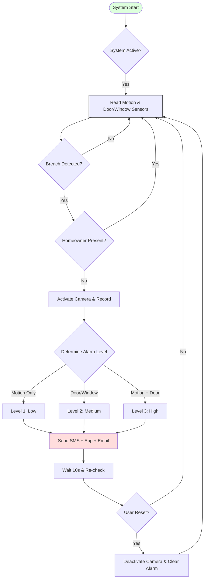
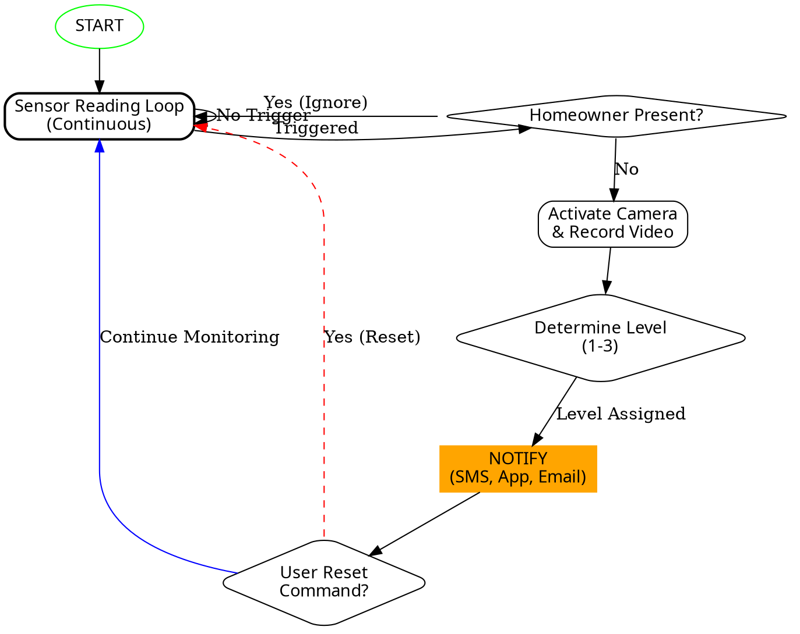

# Task 5: Smart Home Security System

## Overview

This task models a **Smart Home Security System** with continuous sensor monitoring, false alarm prevention via homeowner geofencing, multi-level threat classification, and multi-channel notification (SMS, App Push, Email). The system runs as an infinite monitoring loop with user-controlled reset functionality.

---

## Files

| File | Description |
|------|-------------|
| `pseudocode.md` | Full pseudocode with sensor loop, alarm levels, and notification logic |
| `flowchart.mmd` | Mermaid flowchart diagram |
| `flowchart.dot` | Graphviz DOT flowchart diagram |
| `llm_conversation.txt` | LLM conversation reference |

---

## System Flow

The system operates as a **continuous monitoring loop** with 7 stages:

### 1. Sensor Reading (Continuous Loop)
- Read motion sensor status
- Read door/window sensor status

### 2. False Alarm Check
- If a breach is detected, check if the homeowner's smartphone is within the geofence or connected to home Wi-Fi
- If homeowner is present → ignore trigger and continue monitoring

### 3. Threat Response
- Activate IP camera
- Record video clip

### 4. Alarm Level Determination
| Level | Condition | Severity |
|-------|-----------|----------|
| Level 1 | Motion sensor only | Low (could be a pet) |
| Level 2 | Door/window sensor only | Medium (physical entry point) |
| Level 3 | Both motion + door/window | High (full breach) |

### 5. Multi-Channel Notifications
- Send SMS alert
- Send app push notification
- Send security email (with attached camera clip)

### 6. Wait & Re-check
- Wait 10 seconds for potential user reset

### 7. Reset or Continue
- If user sends reset command → deactivate camera, clear alarm, return to monitoring
- If no reset → continue alert state and loop back

---

## Pseudocode

```
START System
DEFINE AlarmLevel = 0
DEFINE SystemActive = TRUE

WHILE (SystemActive is TRUE) DO
    READ MotionSensorStatus
    READ DoorWindowSensorStatus
    
    IF (Motion OR Door/Window TRIGGERED) THEN
        // False Alarm Check
        IF (isHomeownerPresent()) THEN
            CONTINUE  // Skip to next loop iteration
        END IF

        ACTIVATE IP_Camera → RECORD Video_Clip
        
        // Determine Alarm Level
        IF (Motion AND Door/Window) → AlarmLevel = 3
        ELSE IF (Door/Window) → AlarmLevel = 2
        ELSE → AlarmLevel = 1

        // Send Notifications
        Send_SMS_Alert(AlarmLevel)
        Send_App_Push_Notification(AlarmLevel)
        Send_Security_Email(AlarmLevel, Camera_Clip)

        WAIT (10 Seconds)

        IF (User_Reset_Command) THEN
            AlarmLevel = 0 → Deactivate Camera
        END IF

    ELSE
        AlarmLevel = 0
        PERFORM_IDLE_SYSTEM_DIAGNOSTICS()
    END IF

    WAIT (100 Milliseconds)  // Prevent CPU overload
END WHILE
END System
```

---

## Flowchart (Mermaid)



---

## Flowchart (Graphviz DOT)



---

## Key Features

| Feature | Description |
|---------|-------------|
| Continuous Monitoring | Infinite loop with 100ms cycle to prevent CPU overload |
| False Alarm Prevention | Geofence/Wi-Fi detection of homeowner presence |
| 3-Level Alarm System | Graduated response based on sensor combination |
| Multi-Channel Alerts | SMS, App Push Notification, and Email with camera clip |
| User Reset Control | Manual reset command to return to monitoring mode |
| IP Camera Integration | Automatic activation and video recording on breach |
